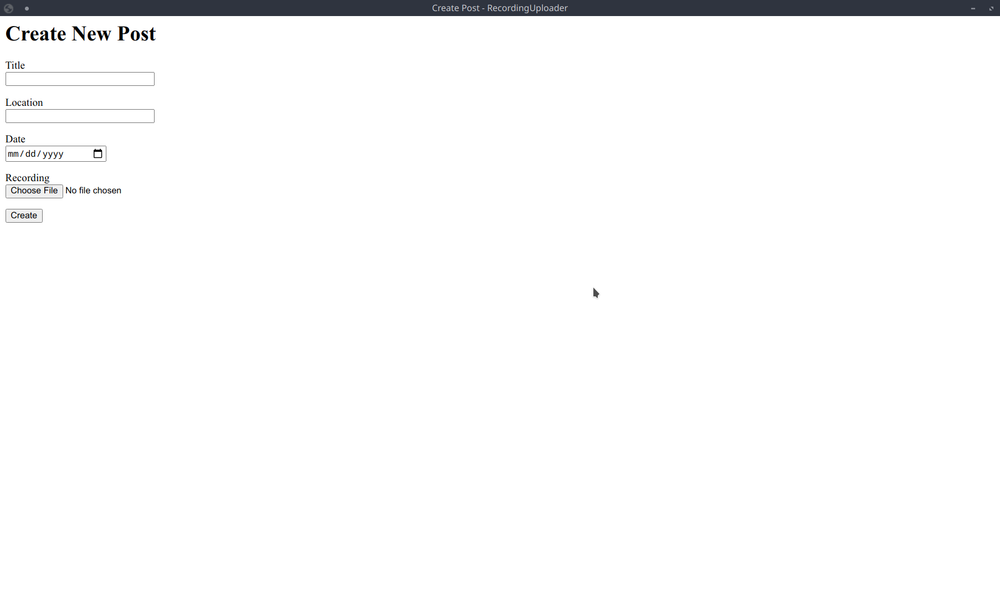

# PythonGUI-Flask
quick template/example of setting up a python GUI app using Flask

Part of my exploration in creating GUI applications with python, to know more check out [my blog](https://jasperabez.github.io/)

# Setting up
Clone this repo and set up a virtual environment to install required modules
```
git clone https://github.com/Jasperabez/PythonGUI-Flask.git
cd PythonGUI-Flask
virtualenv .venv
pip install -r requirements.txt
```

Start the application by running `run.py`, which would look something like this:


# Project Layout
### RecordingUploaderGUI 
Contains the flask code (templates, views, models). Tried to follow closely to the layout highlighted by the [flask docs](https://explore-flask.readthedocs.io/en/latest/organizing.html)
### RecordingUploaderLogic
separate the additional "backend" processing you need to do from the GUI, currently a dummy function is being utilized by the flask code. It also contains a FTP + API function for my usecase.
 
 Feel free to change the name however you would like for your own projects.
 
# Packaging (PyInstaller)
Optional step to freeze your app as a executable, primarily for distribution

In `RecordingUploaderGUI\__init__.py` this section of code (existing) ensures templates, static folder is directed properly when frozen
```
if getattr(sys, 'frozen', False):
    base_dir = os.path.join(sys._MEIPASS)
    app = Flask(__name__,
        static_folder=os.path.join(base_dir, 'static'),
        template_folder=os.path.join(base_dir, 'templates'))
else:
    app = Flask(__name__)
```

When freezing using pyintaller, use flag `--add-data` for any templates and static folder.

`pyinstaller --add-data "RecordingUploaderGUI/templates:templates" run.py`

# Credits
- https://elc.github.io/posts/executable-flask-pyinstaller/ for `--add-data` flag
- [Stackoverflow](https://stackoverflow.com/questions/32149892/flask-application-built-using-pyinstaller-not-rendering-index-html) for correct folder redirection in `__init__.py`
